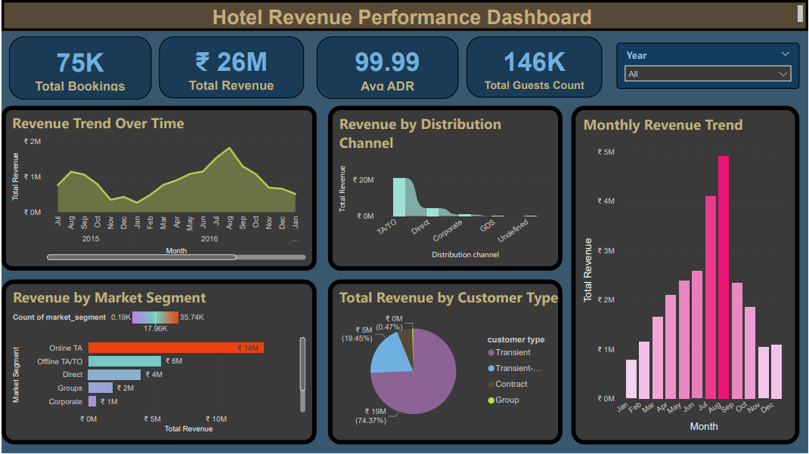
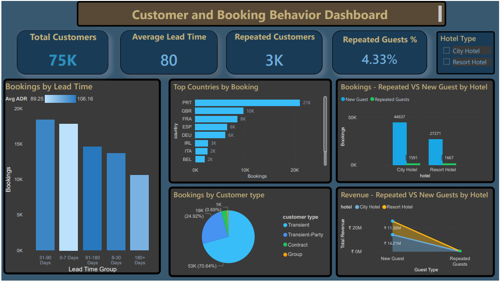
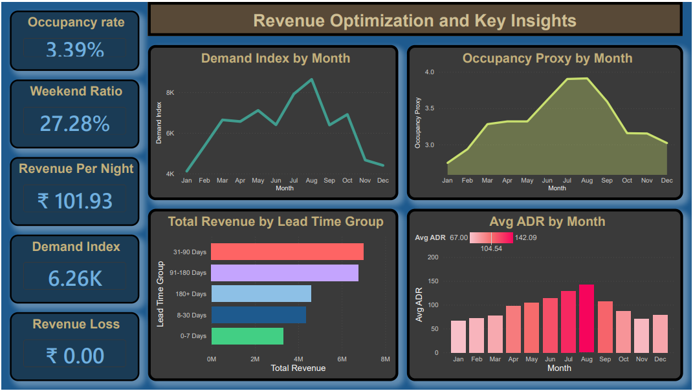
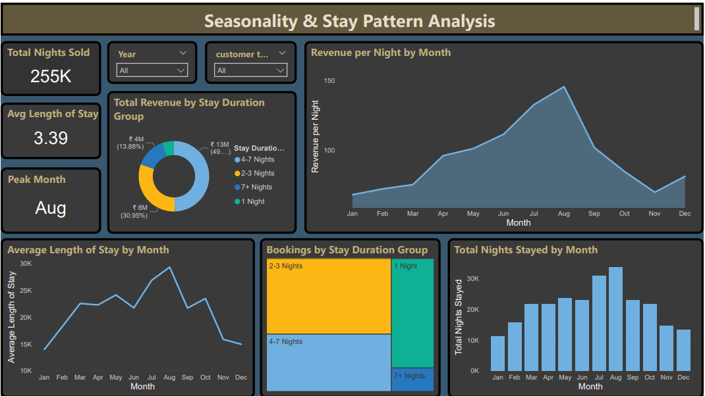

# 🏨 AI-Driven Hotel Revenue Analysis Dashboard (Power BI)

## 📌 Project Overview  
This project presents a **comprehensive hotel revenue analytics solution** built using **Power BI**. It analyzes historical hotel booking data to uncover insights related to **revenue trends, customer behavior, demand patterns, and seasonality**.

The dashboard suite helps stakeholders make **data-driven decisions** for pricing, occupancy optimization, and revenue growth.

---

## 🎯 Objectives  

- Analyze hotel revenue performance across multiple dimensions  
- Understand customer booking behavior and segmentation  
- Identify demand trends and seasonality patterns  
- Optimize pricing and occupancy strategies  
- Provide actionable insights using interactive dashboards  

---

## 📊 Dashboard Modules  

---

### 🟦 1. Hotel Revenue Performance Dashboard  

#### 🔍 Key Insights:
- Total Revenue: ₹26M  
- Total Bookings: 75K  
- Average ADR: 99.99  
- Total Guests: 146K  

#### 📈 Visualizations:
- Revenue trend over time  
- Monthly revenue distribution  
- Revenue by market segment  
- Revenue by distribution channel  
- Customer type contribution  

👉 Revenue is dominated by Online Travel Agencies contributing the largest share.

---

### 🟩 2. Customer & Booking Behavior Dashboard  

#### 🔍 Key Insights:
- Total Customers: 75K  
- Repeated Customers: 3K  
- Repeated Guest Rate: 4.33%  
- Average Lead Time: 80 days  

#### 📊 Visualizations:
- Bookings by lead time group  
- Top countries by bookings  
- Booking distribution by customer type  
- Revenue comparison: new vs repeated guests  
- Hotel type comparison (City vs Resort)  

👉 Most bookings come from transient customers (~70%), indicating short-term stays dominate demand.

---

### 🟨 3. Revenue Optimization & Key Insights  

#### 🔍 Key Metrics:
- Occupancy Rate: 3.39%  
- Weekend Ratio: 27.28%  
- Revenue per Night: ₹101.93  
- Demand Index: 6.26K  
- Revenue Loss: ₹0  

#### 📈 Visualizations:
- Demand index by month  
- Occupancy proxy trends  
- Average ADR trends  
- Revenue by lead time group  

👉 Peak demand and occupancy occur around mid-year (July–August), showing strong seasonal trends.

---

### 🟧 4. Seasonality & Stay Pattern Analysis  

#### 🔍 Key Insights:
- Avg Length of Stay: 3.39 nights  
- Total Nights Sold: 255K  
- Peak Month: August  

#### 📊 Visualizations:
- Stay duration distribution  
- Revenue by stay length  
- Monthly stay trends  
- Revenue per night trends  

👉 Most revenue is generated from 4–7 night stays, making them the most profitable segment.

---

## 🧠 Key Business Insights  

- 📌 Online channels drive the majority of bookings and revenue  
- 📌 Mid-year months show peak demand → ideal for dynamic pricing  
- 📌 Low repeat guest percentage indicates scope for loyalty programs  
- 📌 Longer stays (4–7 nights) generate higher revenue  
- 📌 Lead time significantly impacts booking volume and revenue  

---

## ⚙️ Tools & Technologies  

- **Power BI Desktop** – Data visualization & dashboard creation  
- **DAX (Data Analysis Expressions)** – Calculated measures  
- **Data Modeling** – Relationship building & transformations  

---

## 📁 Project Structure  
📦 Hotel-Revenue-Analysis
┣ 📂 images
┃ ┣ dashboard1.png
┃ ┣ dashboard2.png
┃ ┣ dashboard3.png
┃ ┗ dashboard4.png
┣ 📄 Hotel_Dashboard.pbix
┣ 📄 README.md

---

## 🚀 How to Use  

1. Download the `.pbix` file  
2. Open in Power BI Desktop  
3. Use filters (Year, Hotel Type, Customer Type)  
4. Explore insights across dashboards  

---

## 📌 Future Enhancements  

- Add AI-based revenue forecasting  
- Integrate real-time booking data  
- Implement smart pricing recommendations  
- Improve UI with advanced themes  

---

## 🤝 Contribution  

Feel free to fork the repository and enhance the dashboards or add new insights.

---

## 📬 Contact  

For queries or collaboration, connect via GitHub.
